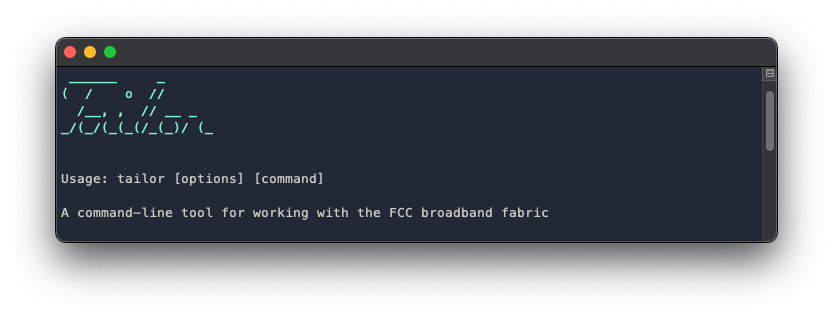

# Tailor

A tool for analyzing and fixing the FCC [broadband serviceable location fabric](https://help.bdc.fcc.gov/hc/en-us/articles/5375384069659-What-is-the-Location-Fabric-)



## Introduction

If you...

- Have a copy of the fabric
- Need to submit bulk location [challenges](https://help.bdc.fcc.gov/hc/en-us/categories/8772052687003-Challenge-Processes)
- Have intermediate GIS skills (can view and edit data with ArcGIS or QGIS)
- Have basic command-line skills (can navigate to a directory and run a command)
- Have permission to install software on your computer

... keep reading!

Tailor will analyze your copy of the fabric and compare it to the ground-truth data you provide. At the end, you'll have GIS layers of potentially missing locations, faulty fabric addresses, and more. You can review these findings and submit the ones you choose as bulk location challenges.

There's no coding necessary, though it helps if you're familiar with your computer's [command line](https://www.pcmag.com/encyclopedia/term/command-line).

### What ground-truth data do I need?

In addition to the fabric, you'll need parcels and building footprints. Tailor can go farther if you have address points (aka "911 addresses"), but these aren't required. Also, a geographic boundary is helpful if you have one, such as city or county limits.

### What if I don't have ground-truth data?

A good place to start is by asking your central IT department, GIS team, and/or assessor's office if they can help you track down the data above. If you strike out with them, don't give up! There's a good chance you can still find it as open data.

For address points, [OpenAddresses](https://openaddresses.io/) is a collection of public-domain addresses from government sources. We've heard about people being told they couldn't get access their county's 911 addresses, only to find them there.

OpenAddresses has *some* building and parcel datasets, though not many. For buildings, a good fallback is Microsoft's [U.S. Building Footprint](https://github.com/microsoft/USBuildingFootprints#download-links) layer. The data quality isn't perfect, but it covers all 50 states. For parcels, Googling "[your county] parcels gis" can yield surprising results.

For geographic boundaries, the [Census Bureau](https://www.census.gov/geographies/mapping-files/time-series/geo/carto-boundary-file.html) may have what you need, or [geoBoundaries](https://www.geoboundaries.org/).

> ⚠️ *General caveat*: don't be alarmed if you see something off here or there, such as an bad parcel boundary or building you know isn't there anymore. Open data won't be perfect, but odds are, you'll still find legitimate errors in the fabric.

### Do I need to be a coder or database expert?

There are no coding skills needed, and you only need to install the Postgres database system and create a new database (we'll walk through how to do this.) Beyond that, you should be fine with GIS skills and a little command-line experience.

### I'm not supposed to share the fabric. Can I still use Tailor?

Great question! Tailor runs entirely on your machine and doesn't upload or share your data anywhere. When you're finished submitting challenges, you can delete it entirely. It's also an open-source project, so you can have someone you trust review the code here. If you still have legal concerns, we recommend seeking counsel and/or contacting FCC.

### Where can I get help and plug in?

Become a part of the Tailor community by joining the [Discord server](https://discord.gg/xmPmDTnRHb)! That's the best place to connect with other users and troubleshoot problems.

For occasional product updates, such as new versions, consider joining the [Google Group](https://groups.google.com/g/broadband-tailor-users).

## Installation

This section covers how to install Tailor and its prerequisites.

### Install required software

First, you'll need to install a few software packages if you don't have them already.

> 🗣️ *Gentle warning*: this section might take some time, especially on Windows. macOS is much easier if you have the option using a Mac. If you run into any issues during installation, feel free to pop into [Discord](https://discord.gg/xmPmDTnRHb) to ask for help.

Also, we are currently looking into alternate ways of packaging up Tailor so it's easier to get started with. We'd love to hear over on Discord what works best for you.

#### Node.js

[Node.js](https://nodejs.org/en/) is an engine for running JavaScript applications, such as Tailor, on your machine. If you've installed Python before, this is the JavaScript equivalent. You can download an installer for Windows or macOS [here](https://nodejs.org/en/download/). Look for any 18.x version.

#### Postgres

[Postgres](https://www.postgresql.org/) is a relational database  system Tailor uses for temporary data storage and analysis. It has an extension called [PostGIS](https://postgis.net/) that adapts it for GIS use.

For Windows users, download the installer for version 15.1 [here](https://www.enterprisedb.com/downloads/postgres-postgresql-downloads). In the install wizard, you'll see an option for "Spatial extensions"; it's important to check that box. For a more detailed tutorial, see [here](https://freegistutorial.com/how-to-install-postgis-on-windows-10/) (note that this uses an older version of Postgres, but the steps should be the same.)

For macOS users, the recommended way to run Postgres is to download [Postgres.app](https://postgresapp.com/), which has PostGIS included. There are some notes on how to install it [here](https://postgresapp.com/documentation/install.html).

#### GDAL

[GDAL](https://gdal.org/) is the library Tailor uses for reading and writing GIS data.

On Windows, we recommend installing GDAL with OSGeo4W. Follow the steps [here](https://trac.osgeo.org/osgeo4w/wiki/WikiStart#QuickStartforOSGeo4WUsers), and when asked which packages to install, select "GDAL".

On macOS, we recommend installing GDAL with Homebrew. See the Homebrew [homepage](https://brew.sh/) for a one-liner to install it. Next, run `brew install gdal` from your command line.

### Open a command shell

Now that you have everything Tailor needs to run, open up a new command shell (aka command prompt, or terminal window). This is how you'll run one last setup step and get started using Tailor.

On Windows, [open](https://www.guidingtech.com/ways-to-open-command-prompt-on-windows/) the program called Command Prompt. On macOS, [open](https://www.howtogeek.com/682770/how-to-open-the-terminal-on-a-mac/) the Terminal app.

If you haven't worked with command-line software before, we'll cover the important parts, but you may want to read up or watch a video on some basic operations, such as changing directories and running programs. Here's a [tutorial](https://www.digitalcitizen.life/command-prompt-how-use-basic-commands/) for Windows, and one for [macOS](https://www.makeuseof.com/tag/beginners-guide-mac-terminal/).

### Create a new database

Next you'll need to open psql, a command-line program for working with Postgres. On Windows, open the Start menu and search for "psql"; open the result "SQL Shell (psql)". On macOS, you can type `psql` from the terminal.

By default, psql will connect to a database called `postgres`. (You may have set a password for this during installation and will need to enter it before continuing.)

Type this command and hit Enter to create a new database called `tailor`:

```
create database tailor;
```

Now connect to the `tailor` database and enable PostGIS:

```
\c tailor
create extension postgis;
```

Your analysis database is now set up, and you're ready to start install Tailor. Go ahead and close the psql window.

### Installing Tailor

Head back to your command line and run this command:

```bash
npm i -g @workspublic/tailor
```

When that finishes, you're ready to get started with Tailor! It's now available on your command line as `tailor`. Keep reading for more details on how to use it.

## Usage

Tailor has two main pieces of functionality: 1) loading your fabric and ground-truth data, and 2) analyzing the fabric.

> 💡 *Tip*: you can run `tailor` from your command line to see a list of available commands. For details about a command, run `tailor [command] --help`.

### Loading data

Follow these steps to load in your fabric and ground-truth data.

From the command line...

1. `tailor load-boundary [path to your boundary shp or geojson]`. *Note:* while having a boundary isn't required, it's recommended for a faster, more accurate analysis. If you have a boundary, it should be loaded in before any other datasets.
2. `tailor load-parcels [path to your parcels shp or geojson]`. This may take a few minutes depending on the size of your jurisdiction.
3. `tailor load-buildings [path to your building footprints shp or geojson]`. This may also take a few minutes.
4. `tailor load-addresses [path to your address points shp or geojson] [address column] [address type]`. This one's a bit more complex — the third argument is the name of the column in your address point layer that contains the addresses you want to compare to the fabric's addresses. The fourth argument should be either `street` or `full`. *Hint*: if your addresses have ZIP codes, use `full`; otherwise, use `street`. A full example might look like `tailor load-addresses addresses.shp streetaddr full`, if your address column is `streetaddr` and you have ZIP codes.
5. `tailor load-bsls [path to your fabric csv]`

After that, you're ready to start with analysis.

### Running the analysis

You're almost there! Run this to kick off your fabric analysis:

```bash
tailor analyze
```

This might take a few minutes to run. At the end, there will be three new layers in your Postgres database you can bring into your GIS software.

1. `bsls_analyzed`
2. `bsls_address_match_lines`
3. `parcels_analyzed`

## Exploring the analysis layers

> 🚧 *Note*: this section is under construction, but will hopefully help get you started reviewing what Tailor found in the fabric. Feel free to hop onto [Discord server](https://discord.gg/xmPmDTnRHb) with questions.

First, open up your GIS software. You'll want to connect to the `tailor` Postgres database. Here's how to do that from [ArcGIS](https://pro.arcgis.com/en/pro-app/latest/help/data/databases/connect-postgresql.htm) or [QGIS](https://scdm.geography.wisc.edu/2020/12/08/spatial-database-connect-to-postgresql-postgis-through-qgis/).

Once you've connected, add these layers to a new project, in addition to your fabric:

1. `bsls_analyzed`
2. `bsls_address_match_lines`
3. `parcels_analyzed`

You may also want to add a basemap for orientation, along with your ground-truth data.
